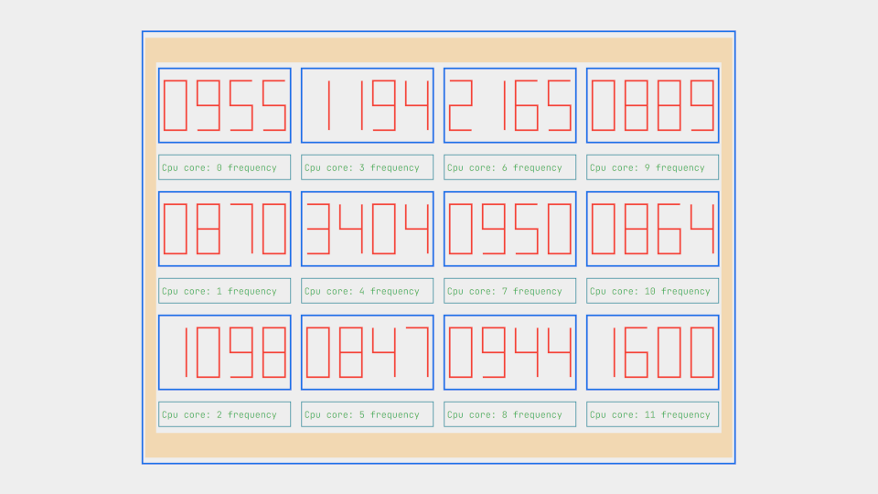

# seven_seg

### Pseudo seven segment digital display.

### Examples
  
```rust
 use seven_seg::sevseg_four;
 let four_digits = sevseg_four("8023").unwrap();
 assert_eq!(&four_digits, "┏━━━┓ ┏━━━┓ ╺━━━┓ ╺━━━┓\n\
                           ┃   ┃ ┃   ┃     ┃     ┃\n\
                           ┣━━━┫ ┃   ┃ ┏━━━┛ ╺━━━┫\n\
                           ┃   ┃ ┃   ┃ ┃         ┃\n\
                           ┗━━━┛ ┗━━━┛ ┗━━━╸ ╺━━━┛\n"
 );
 
```
Example cpu_freg.rs from the examples folder.


  
## License
GNU General Public License v3.0 
